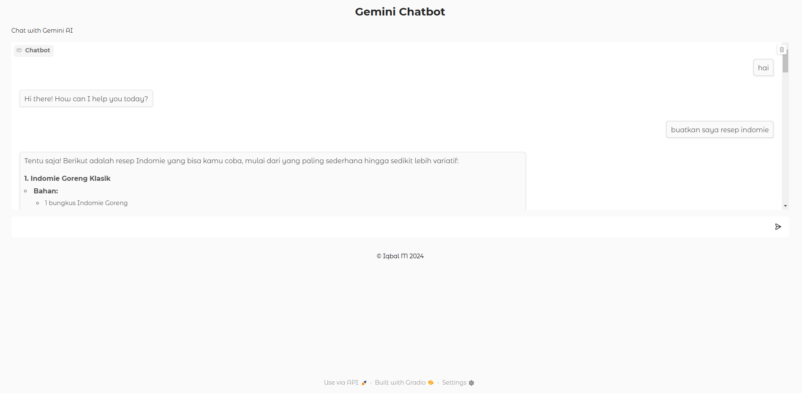

## Gemini Chatbot
Chatbot sederhana menggunakan Google Gemini API dengan interface Gradio.

# 1. Clone repository
git clone [[repository-url](https://github.com/ibalm9/Gemini-Chatbot-API-with-Gradio.git)]

# 2. Install dependencies
pip install -r requirements.txt

# 3. Buat file .env dan isi GOOGLE_API_KEY
echo "GOOGLE_API_KEY=your_api_key_here" > .env

# 4. Jalankan aplikasi
python -m src.app